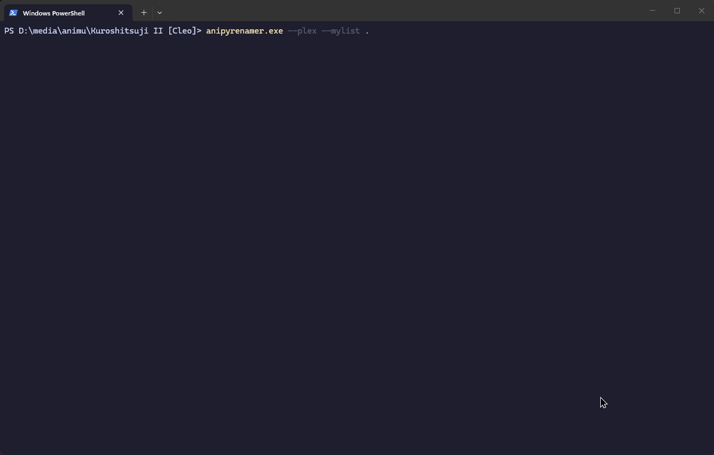

# anipyrenamer

[](https://pypi.org/project/anipyrenamer/)
[](https://pypi.org/project/anipyrenamer/)

**Current release:** 1.1.1 — published on [PyPI](https://pypi.org/project/anipyrenamer/) and tagged on [GitHub](https://github.com/eunai/anipyrenamer/releases).

`anipyrenamer` is a command-line tool that renames anime files using ED2K hash lookups from AniDB, with local SQLite caching for faster reruns and offline support.

It fits alongside local media libraries (Plex/Jellyfin folders, plain disk collections): you point it at files or folders, it resolves titles and episode metadata from AniDB, then renames in place or into a destination tree.

## Requirements

- **Python 3.13+**
- An AniDB account and UDP API client registration (for online lookup). You can use `--offline` when the SQLite cache already has the rows you need.

## Install

```bash
python -m venv .venv
source .venv/bin/activate   # Windows: .venv\Scripts\activate

pip install anipyrenamer
```

The `pip install anipyrenamer` distribution does **not** ship `.env.example`. Copy the template from the [public repository](https://github.com/eunai/anipyrenamer/blob/main/.env.example) and save it as `.env` in a location below (never commit `.env` or real credentials).

## Configuration

Put credentials and client strings in `.env`. Required for online mode:

- `ANIDB_USERNAME`, `ANIDB_PASSWORD`, `ANIDB_UDP_CLIENT`, `ANIDB_UDP_CLIENTVER`, `ANIDB_LOCAL_PORT`

Optional:

- `ANIDB_API_KEY` — enables AniDB UDP `ENCRYPT` / AES-encrypted sessions when set

**Where `.env` is loaded:** The CLI walks **upward from your process current working directory** and loads the first `.env` found, then loads the well-known file: Windows `%APPDATA%\anipyrenamer\.env`, Linux/macOS `~/.config/anipyrenamer/.env`. The second load only fills variables that are **still unset** after the first. **Variables already set in your environment are not overridden** (same idea as `python-dotenv` with `override=False`).

For a stable location when you run from many folders, create the well-known directory if needed and place `.env` there.

### Security

- **Unix/macOS:** Prefer `chmod 600` on `.env`; the CLI warns if `.env` appears group- or world-readable.
- **Windows:** The CLI does not change ACLs; keep `.env` under your user profile or restrict NTFS permissions.
- **AniDB UDP:** With `ANIDB_API_KEY` set, traffic uses `ENCRYPT` after setup. If it is missing or setup fails, the CLI warns and falls back to plaintext UDP — use a least-privilege AniDB account and avoid untrusted networks.

**Cache:** When the current directory or a parent contains `pyproject.toml`, the default database is project root `.cache/anipyrenamer_cache.sqlite`. Otherwise use the `.cache` subdirectory under the same well-known app config directory as `.env` (Windows: `%APPDATA%\anipyrenamer\.cache\anipyrenamer_cache.sqlite`, Unix: `~/.config/anipyrenamer/.cache/anipyrenamer_cache.sqlite`). Override with `--db`.

## Usage

```bash
anipyrenamer <path> [paths...]
```

Examples:

```bash
anipyrenamer "C:\Videos\Anime" --dry-run
anipyrenamer "C:\Videos\Anime"
anipyrenamer "C:\Videos\Anime" --yes
anipyrenamer "C:\Videos\Anime" --offline
anipyrenamer "C:\Videos\Anime" --plex
anipyrenamer "C:\Videos\Anime" -t "%title% S01E%epno%%ext%" -d "C:\Renamed"
anipyrenamer "C:\Videos\Anime" --mylist
```

Use `anipyrenamer --help` for all options.

### Demo: `--plex --mylist`

This demo shows running `anipyrenamer` with Plex-style folders and the MyList wizard (`--plex --mylist`).



### Confirmation prompts

Interactive confirmations use `Prompt text (Y/n/a):` — `Y` (default), `n`, or `a` (yes to all remaining).

## Platforms

Developed and tested on **Windows** and **Unix-like** systems (Linux, macOS). Paths in examples use Windows style where helpful; adjust for your OS.

## Troubleshooting

See [docs/runbook.md](docs/runbook.md) for exit codes, common failures, and safe reruns.

## Contributing and issues

Report bugs and request features on [GitHub Issues](https://github.com/eunai/anipyrenamer/issues).

**From source:** Clone [eunai/anipyrenamer](https://github.com/eunai/anipyrenamer) and follow its README for optional editable install (`pip install -e .`), running tests when you hack on the code, and any extra dev dependencies.

## Development note

Parts of this codebase were written or refactored with **AI-assisted coding tools**, alongside manual design, testing, and review. Human maintainers remain responsible for behavior and releases.

## License

Distributed under the [MIT License](LICENSE). Dependency licenses vary; review them when preparing redistributions (wheel, bundle, installer).
